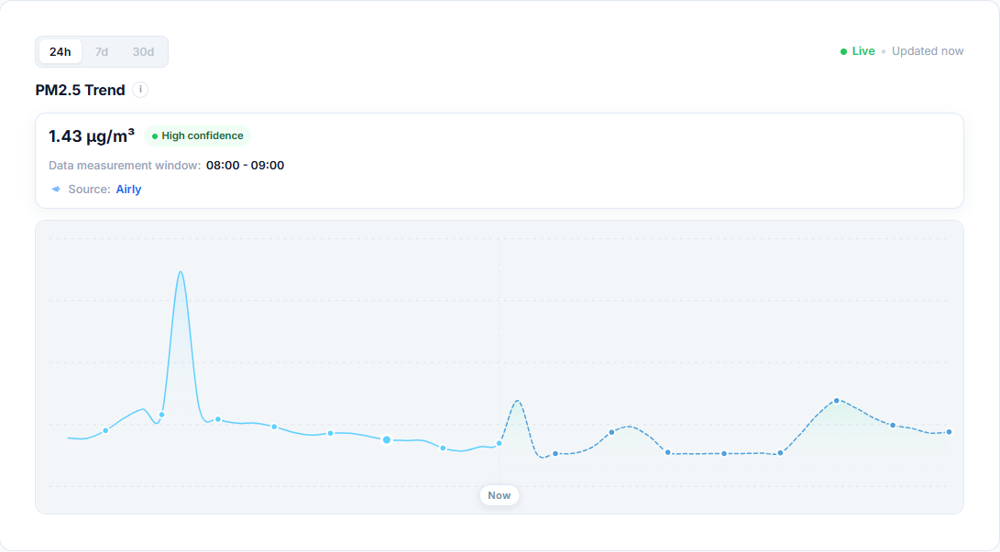
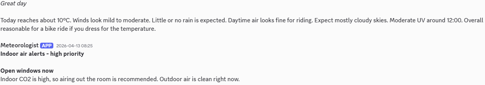
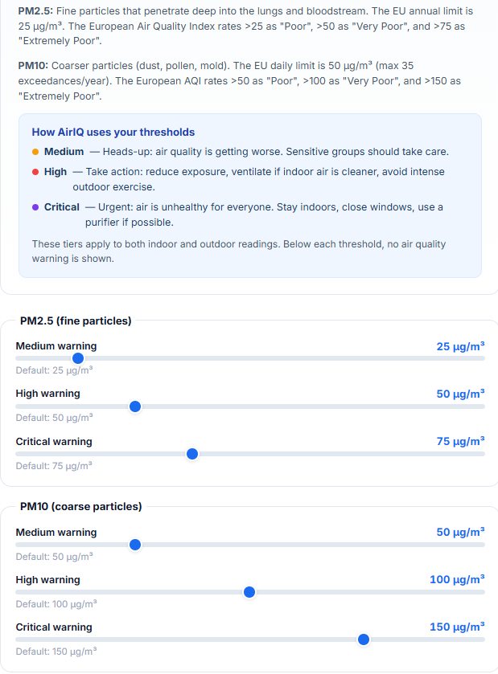

# AirIQ

AirIQ is a full-stack air quality and wellness platform that combines outdoor air data, indoor sensor readings, wearable exports, and AI-assisted guidance in one product.

I built it to practice end-to-end product engineering around a real user problem: designing a polished frontend, shaping backend business logic, integrating third-party services, running scheduled jobs, and turning messy health and environment data into something actionable.

## Why This Project Exists

Most air-quality apps stop at a single AQI number. I wanted to explore what happens when you connect that outdoor context with the rest of everyday life:

- indoor sensor readings from a real device
- sleep and training data from wearable exports
- user-specific thresholds and notification preferences
- AI wording only where it improves clarity instead of replacing product logic

The result is a project that feels more like a small product than a demo app.

## System Features

### Outdoor air intelligence

- Looks up locations with geocoding and reverse geocoding.
- Pulls and normalizes outdoor air-quality and weather data from multiple providers.
- Surfaces current conditions, forecasts, and map-based exploration.
- Presents environmental data in a way that supports daily decisions like training, commuting, and ventilation.

### Indoor monitoring and household context

- Connects Qingping indoor sensors and stores indoor readings over time.
- Tracks indoor PM, humidity, temperature, CO2, and device history.
- Generates rule-based indoor suggestions such as ventilation, comfort, and air-quality warnings.
- Supports household-style usage where recommendations are tied to real living conditions, not just a static dashboard.

### Wearable and activity insights

- Imports Garmin sleep and training exports for deeper health context.
- Supports Strava integration for synced training activity data.
- Combines environment and activity signals so recommendations are not isolated from recovery or exercise.
- Generates AI-assisted training and recovery insights from imported activity, sleep, and environmental context, with product logic still grounded in structured data.

### Personalized guidance

- Uses deterministic recommendation logic for core product behavior.
- Adds optional Gemini-powered wording for human-friendly summaries and explanations.
- Keeps AI as a presentation layer on top of structured product logic instead of making it the source of truth.

### Notification center and user tuning

- Sends scheduled Discord morning outlook messages with weather and air-quality context.
- Sends indoor alerts when sensor data crosses important thresholds.
- Lets users tune delivery preferences and alert sensitivity to match their needs.
- Exposes threshold settings for PM2.5, PM10, UV, temperature, humidity, and CO2, with EU and WHO-style reference context visible in the product.

### Product and admin flows

- Includes authentication, sessions, email verification, password reset, and account settings.
- Supports feedback collection and recommendation tuning.
- Includes admin views for system oversight and iteration on user-facing guidance.

## Screenshot Tour

| View | Preview |
| --- | --- |
| Landing page with product framing, onboarding, and a more polished public-facing entry point. |  |
| Main dashboard that brings together outdoor conditions, indoor context, and recommendations in one place. |  |
| Indoor history view for tracking how sensor readings change over time instead of showing only the latest value. |  |
| AI-assisted training insights that turn imported activity data, recovery signals, and environmental context into more useful summaries and guidance. |  |
| Map view for exploring air-quality conditions spatially rather than only by a saved location. |  |
| Discord notifications sent to the user for proactive delivery of outdoor outlooks and indoor alerts. |  |
| Alert settings where users can tune thresholds to their needs and compare them against reference standards. |  |

## Tech Stack

### Frontend

- React 19
- Vite
- i18next
- Mapbox GL

### Backend

- FastAPI
- SQLAlchemy
- Alembic
- APScheduler
- PostgreSQL

### Integrations and services

- Qingping
- Garmin data exports
- Strava
- Airly
- OpenAQ
- Open-Meteo
- Nominatim
- Google Gemini
- Postmark
- Discord webhooks

## Architecture Overview

AirIQ is split into a React frontend and a FastAPI backend, with scheduled jobs and third-party integrations handled on the server side.

- [`frontend2.0`](./frontend2.0) contains the landing page, dashboard UI, map experiences, auth flows, settings, and data visualizations.
- [`backend`](./backend) exposes REST endpoints, manages persistence, runs scheduled jobs, and coordinates integrations.
- SQLAlchemy models and Alembic migrations manage the database schema and data evolution.
- Service modules in [`backend/services`](./backend/services) hold the domain logic for recommendations, imports, alerts, and enrichment.
- Tests in [`backend/tests`](./backend/tests) cover core logic such as recommendation rules, weather handling, sleep insights, Qingping sync, Discord alerts, and credential encryption.

## Repository Structure

```text
AirIQ/
|- backend/        FastAPI app, database models, services, routers, Alembic migrations, tests
|- frontend2.0/    React app, dashboard UI, pages, components, i18n, map views
|- docs/readme/    README screenshots and visual assets
|- infra/          Deployment/bootstrap scripts
`- .github/        GitHub Actions workflow
```

## Engineering Highlights

- Built a multi-source backend that normalizes data from external air-quality and weather providers into a consistent shape.
- Added Qingping integration for indoor readings, encrypted credential storage, sync scheduling, persistence, and history endpoints.
- Implemented Garmin import flows and Strava sync paths for training-related insights.
- Added Discord delivery flows for scheduled outdoor outlooks and indoor alerts.
- Kept recommendation logic deterministic, then layered optional AI-generated wording on top for explainability.
- Added tests for recommendation logic, sleep and training insight helpers, provider integrations, Discord notification behavior, and encryption utilities.

## Quick Start

### Prerequisites

- Python 3.11+
- Node.js 20+
- PostgreSQL

### 1. Install dependencies

```bash
python -m venv .venv
# Windows: .\.venv\Scripts\Activate.ps1
# macOS/Linux: source .venv/bin/activate
pip install -r backend/requirements.txt

cd frontend2.0
npm ci
cd ..
```

### 2. Configure environment variables

Use the root [`.env.example`](./.env.example) as a template:

- copy the backend section into `backend/.env`
- copy the frontend section into `frontend2.0/.env`

For a basic local setup, the database variables are the only hard requirement. Most integrations are optional and can be added later.

### 3. Run database migrations

```bash
cd backend
alembic upgrade head
cd ..
```

### 4. Start the backend

Run this from the repository root:

```bash
python -m uvicorn backend.app:app --reload --host 127.0.0.1 --port 8000
```

### 5. Start the frontend

In a second terminal:

```bash
cd frontend2.0
npm run dev
```

The frontend will be available at `http://localhost:5173` and will talk to the backend at `http://127.0.0.1:8000` when `VITE_API_BASE_URL` is set accordingly.

## Environment Notes

### Backend essentials

- `DB_HOST`, `DB_PORT`, `DB_NAME`, `DB_USER`, `DB_PASSWORD`: PostgreSQL connection settings.
- `DB_SSLMODE`: use `disable` for a local PostgreSQL instance, or `require` for managed environments that expect SSL.
- `FIELD_ENCRYPTION_KEY`: strongly recommended for encrypted integration credentials and Discord webhook storage.
- `FRONTEND_BASE_URL`: used for email links and OAuth redirects.
- `CORS_ORIGINS`: comma-separated list of allowed frontend origins.

### Optional backend integrations

- `AIRLY_API_KEY`, `OPENAQ_API_KEY`: outdoor data providers.
- `GOOGLE_API_KEY`: Gemini-powered wording for insights.
- `POSTMARK_API_TOKEN`, `EMAIL_FROM`: activation and password reset emails.
- `STRAVA_CLIENT_ID`, `STRAVA_CLIENT_SECRET`, `STRAVA_REDIRECT_URI`, `STRAVA_STATE_SECRET`: Strava OAuth.
- `QINGPING_*`: override Qingping API endpoints, scope, timeout, and sync interval if needed.

### Frontend essentials

- `VITE_API_BASE_URL`: backend base URL for API requests.
- `VITE_MAPBOX_TOKEN`: required for the map and globe views.
- `VITE_STUDIO_STYLE_URL`: optional custom Mapbox Studio style.

## Testing

Run backend tests:

```bash
python -m pytest backend/tests
```

Build the frontend:

```bash
cd frontend2.0
npm run build
```

Optional lint step:

```bash
cd frontend2.0
npm run lint
```

## What This Project Helped Me Practice

- building a full-stack application around a real user problem instead of a toy dataset
- structuring backend logic beyond simple CRUD endpoints
- integrating several external services with different data shapes and reliability characteristics
- balancing product design, data modeling, background processing, and frontend UX
- using AI where it supports understanding instead of turning the app into an AI wrapper

## Possible Next Improvements

- Add Docker Compose for a faster one-command local setup.
- Add CI coverage for backend tests in addition to deployment.
- Add a public demo environment with seeded example data.
- Expand observability around background jobs and provider sync health.
