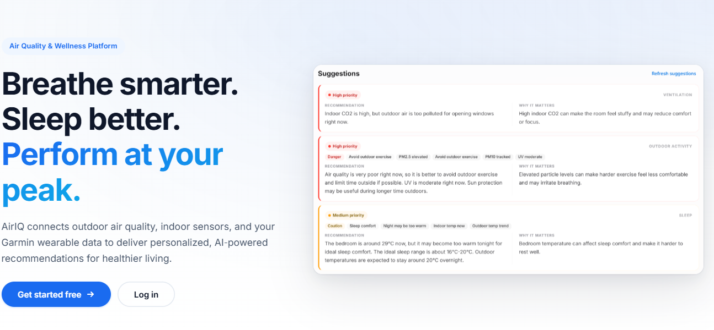
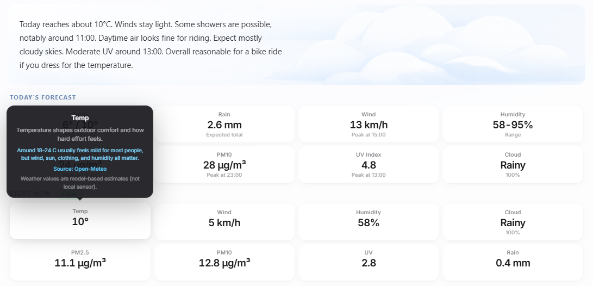
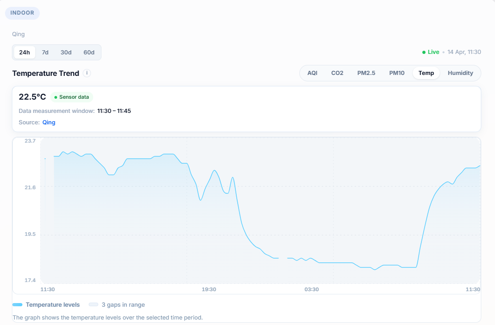
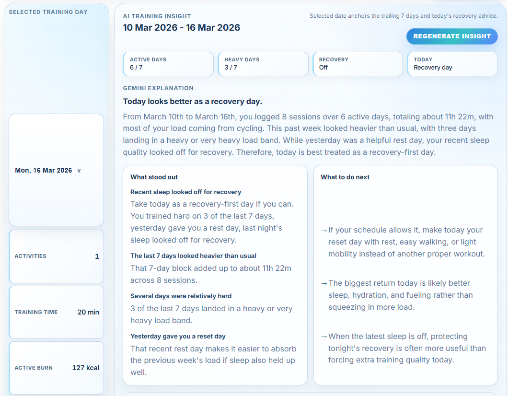
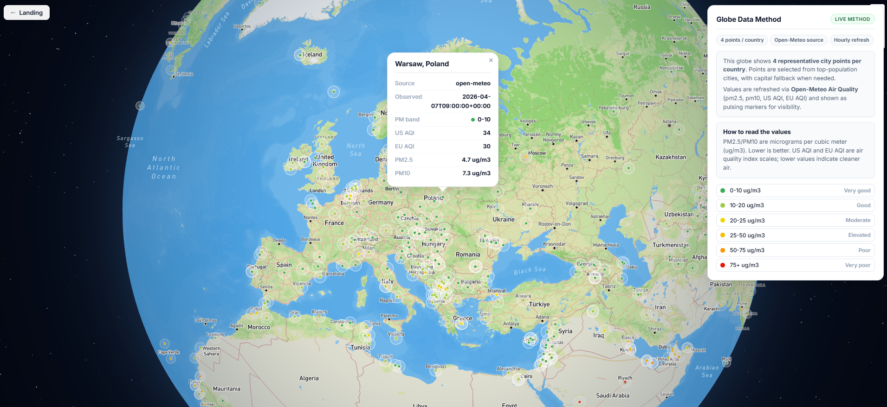

# AirIQ

AirIQ is a full-stack air quality and wellness platform I built to create something I would actually use in daily life.

My goal was to practice building a complete product end to end: a polished frontend, a backend with real business logic, third-party integrations, background jobs, authentication flows, and practical AI features. I wanted one app that could combine outdoor air quality, indoor sensor readings, wearable health exports, and AI-generated guidance into a single experience.

## Why I Built It

This project started as a way to explore three things at once:

- building a full-stack application with a real product feel
- learning how to integrate and normalize data from third-party services
- using AI in a practical way instead of as a gimmick

I also wanted to work on something personally meaningful. AirIQ let me combine environmental data, indoor conditions, sleep, and training into a product centered around healthier daily decisions.

## What AirIQ Does

AirIQ brings together multiple data sources and turns them into user-facing insights:

- outdoor air quality lookup with geocoding, forecasts, and map views
- indoor air monitoring through Qingping sensor integration
- Garmin sleep and training data imports
- AI-powered recommendations based on environment and user context
- authentication, account management, and email-based activation/reset flows
- admin views for feedback, recommendation tuning, and system health

## Screenshots







## Tech Stack

### Frontend

- React 19
- Vite
- i18next
- Mapbox GL

### Backend

- FastAPI
- SQLAlchemy
- Alembic
- APScheduler
- PostgreSQL

### Integrations and Services

- Qingping
- Garmin data exports
- Airly
- OpenAQ
- Open-Meteo
- Nominatim
- Google Gemini
- Postmark

## Architecture Overview

The app is split into a React frontend and a FastAPI backend.

- The frontend in [`frontend2.0`](./frontend2.0) handles the landing page, dashboard, map views, auth flows, and data visualizations.
- The backend in [`backend`](./backend) exposes REST endpoints, stores application data, integrates external services, and runs scheduled jobs.
- SQLAlchemy models and Alembic migrations manage the database layer.
- Background jobs are used for sync and maintenance tasks.
- Recommendation logic combines outdoor data, indoor sensor readings, and imported wellness data into actionable suggestions.

## Engineering Highlights

- Built a multi-source backend that can normalize external air-quality and weather data into a consistent format.
- Added Qingping integration for indoor readings, including device selection, persistence, and history endpoints.
- Implemented Garmin import flows for sleep and training analysis.
- Added AI recommendation endpoints powered by Gemini to generate user-facing guidance.
- Built auth flows with registration, activation, password reset, and protected endpoints.
- Added tests for core recommendation and integration logic in [`backend/tests`](./backend/tests).

## What I Wanted To Practice

This project gave me hands-on practice with:

- designing a full-stack app around a real user problem
- working with imperfect third-party APIs and exported data
- structuring backend logic beyond simple CRUD endpoints
- connecting data engineering, product design, and frontend UX
- using AI features where they support the product instead of dominating it

## Running Locally

### Backend

From the project root:

```bash
python -m venv .venv
.venv\Scripts\activate
pip install -r backend/requirements.txt
alembic -c backend/alembic.ini upgrade head
uvicorn backend.app:app --reload --host 0.0.0.0 --port 8000
```

Create `backend/.env` with your local settings. The backend expects database settings such as:

- `DB_HOST`
- `DB_PORT`
- `DB_NAME`
- `DB_USER`
- `DB_PASSWORD`

Optional integrations use environment variables such as:

- `AIRLY_API_KEY`
- `OPENAQ_API_KEY`
- `GOOGLE_API_KEY`
- `POSTMARK_API_TOKEN`
- `CORS_ORIGINS`

### Frontend

From [`frontend2.0`](./frontend2.0):

```bash
npm install
npm run dev
```

Useful frontend environment variables:

- `VITE_API_BASE_URL`
- `VITE_MAPBOX_TOKEN`
- `VITE_STUDIO_STYLE_URL`

## Tests

Backend tests currently live in [`backend/tests`](./backend/tests) and are written with `unittest`.

Run them from the project root with:

```bash
python -m unittest discover backend/tests
```

## Interview Talking Points

If I were walking an interviewer through this project, I would highlight:

- how I designed the system around multiple external data sources
- how I translated raw sensor and provider data into user-facing recommendations
- how I approached full-stack product development instead of just isolated features
- where AI adds value in the workflow and where deterministic logic is still the better fit
- what I would improve next around deployment, observability, and production hardening

## Next Improvements

- stronger deployment documentation and environment setup
- clearer observability and background job monitoring
- more device and data-source integrations
- richer screenshot/demo material for the portfolio presentation
